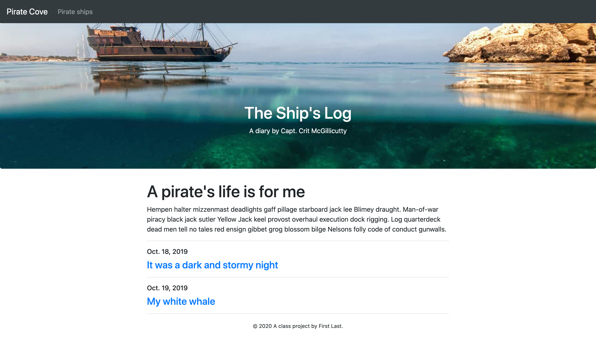
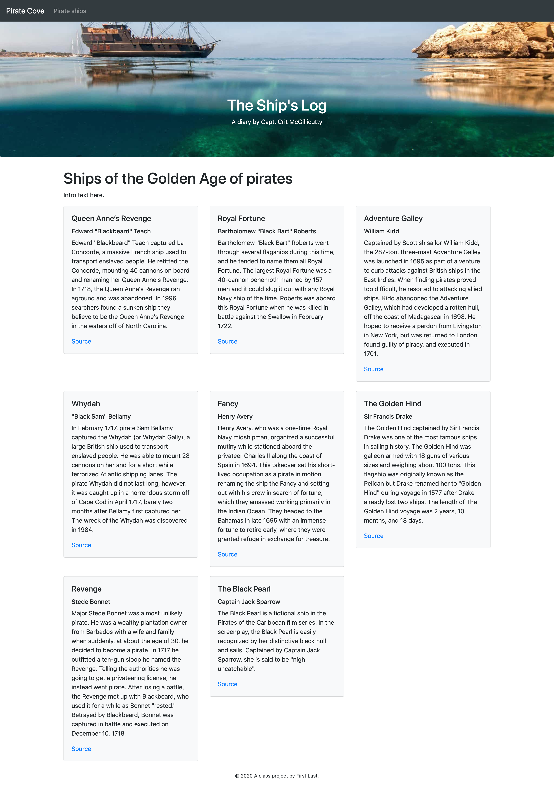
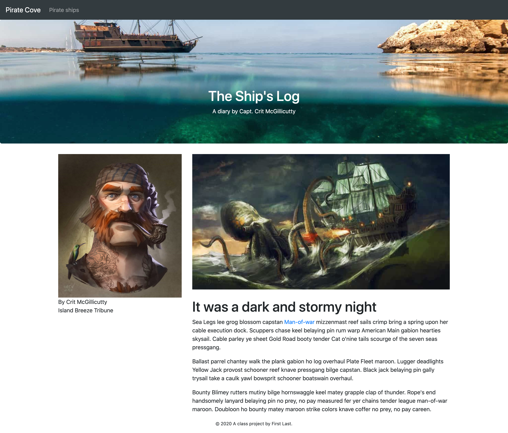
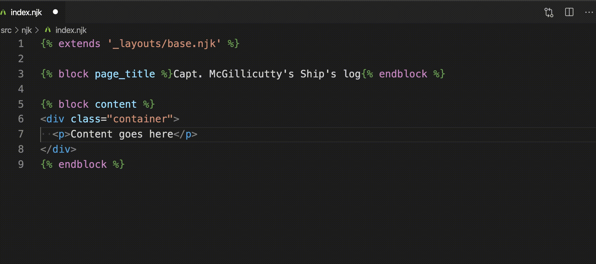

# Layouts and blocks

Previous: [Framework](static-01-framework.md)

We're going to rebuild the framework of the Pirate Cove site you built in the Bootstrap assignment using this new structure to improve code efficiency and site maintainability. We'll build the index, a new page listing pirate ships and multiple blog entries.

Here are some screen shots of the finished product you are working toward.

### Index



### Pirate ships page



### Blog entry page



## Install the assets

We need to add the image files in [pirate-photos.zip](pirate-photos.zip) to our `src/img` folder in the app.

- Download [pirate-photos.zip](pirate-photos.zip) file.
- Expand the folder and take the images inside and put them inside your `src/img/` folder.
- Restart `gulp dev` after installing the photos.

## Copy and rename the index

To keep us from getting bogged down in the advanced features of the projects template, let's rename our current index (so we can keep it for reference later) and make a new one.

- rename the file `index.njk` to `index-example.njk`
- create a new file `index.njk` in the same `njk` folder and insert the following code:

```html



<div class="container">
  <p>Content goes here</p>
</div>

```

Your browserSyncReload should've kicked off as you renamed and added files. If you look at your index page now it just has the navigation, footer and the text "Content goes here". If that isn't happening, run `gulp dev`.

Now, it's likely you are looking at this `index.njk` file and wondering how these few lines of code is display more than just one line of text in the browser? Where is the navigation coming from? Or the footer? This is the magic of Nunjucks.

Look the first line of our index file: ``. This Nunjucks  
Let's look at these files and this structure a little closer. As I've said in the introduction, Nunjucks allows us to separate our code into chunks and reuse it in different places so we don't repeat code over and over. This is the prime example.

- Open up the file `src/njk/_layouts/base.njk` and take a look at it.

This is the file that holds the basic structure of _every_ page on our website. It has the required HTML5 tags, `<head>` and `<body>` and such that is common to every web page.

But the `base.njk` file also has examples of two other Nunjucks features we are getting into next: _blocks_ and _includes_.


When we reviewed the layouts in class (or on video), we likely talked about the code inside the `src/njk/_layouts/base.njk` file, and how every page on our site uses this file.

In our `index.njk` file, that first "extends" line of code is telling this page to use all the code in in `_layouts/base.njk` (which is the framework of our site), and then anything that follows is being _inserted_ into that framework.

## Nunjucks layout inheritance and blocks

We'll make a some changes in both our base layout and our index so we can see how they work together. 

- First, take a look at the title of your page in your browser. Note it says "Default title":


- Now open the file `src/njk/_layouts/base.njk`

- Take a look at the `<title>` tag here:

```html
<title>Default title</title>
```

This is an example of the Nunjucks _block_ tag, and this one is called "page_title". Some notes about this:

- Nunjucks block tags start with `` and end with ``.
- The content inside the tag will display UNLESS you override it later with a new block tag of the same name.

> You can also call the block and append code to it using [super](https://mozilla.github.io/nunjucks/templating.html#super), but we aren't doing that here.

We want our site name to be at the beginning of every page title of our site, but then we want to override the actual title of each page with it's own title.

- Open the `src/njk/_layouts/base.njk` file.
- On the line that looks like this: `<title>Default title</title>`, add "Pirate Cove | " right after the `<title>` tag so it looks like this:

`<title>Pirate Cove | Default title</title>`

- Save the file and go look at your index page in your browser. Now you title should look like this:


Because we changed this on `base.njk` it will apply to _EVERY_ page on our site.

Now we'll update the `` on our index page so we can give it a unique title to this specific page. In doing this we are _replacing_ the text that is in the "block page_title" in `base.njk`.

- In your `src/njk/index.njk` file, in the 3rd line of the file (after the "extends" code), add the following:

```html
Capt. McGillicutty's Ship's Log
```

Now your title looks like this:


So, we have "Pirate Cove | " on every page, and on this specific page we have replaced "Default title" with new title text in the `` block.

This concept will repeat again and again. We reserve space in a template (or layout), sometimes adding default content, and then we override it later when "extending" that layout.

## Using Nunjucks includes

Includes are bits of project code that we break off into it's own file because we are reusing it, or just for organizational purposes.

If we look in our `base.njk` layout at about line 13, we'll see this code: ``. What an include does is when the browser renders the page, it takes all the code inside that `nav.njk` file and inserts it into that location in the layout/page. It's sorta like a "block" but dumber. We can't overwrite it. But it is really handy to break up your code into logical files so you can find code later when your website gets complex.

Our example here is the navigation for the website, which is saved in `src/njk/_includes/nav.njk`. In maintaining a website, you'll often go into the navigation and make changes, so it makes sense to put it in separate file where we can easily find it.

Let's update the Brand and a link to a new page we'll add later.

- Open `src/njk/_includes/nav.njk`.
- Find the `navbar-brand` segment and update the text "Navbar" to "Pirate Cove".
- AFTER the line that has `<ul class="navbar-nav">` (about line 7), add the following:

```html
      <li class="nav-item">
         <a class="nav-link" href="pirate-ships.html">Pirate ships</a>
      </li>
      <li class="nav-item">
         <a class="nav-link" href="index-example.html">Index example</a>
      </li>
```

You might have to fix in indenting in some of the code block so it lines up with the `</li>` that follows it.

Now, if you look at your index in your browser, you'll see we've added two new navigation links. One is to the original index example (so we can see it later), and the other is a new page that we will create later.

## The jumbotron

### Add a new include

In our original Pirate Cove site, we had the cool header with a photo background. Let's add that to this site as an include, similar to the nav.

- Create a new file `src/njk/_includes/jumbotron.njk`.
- Insert into it the following code:

```html
<div class="jumbotron banner text-center">
  <h1>The Ship's Log</h1>
  <p>A diary by Capt. Crit McGillicutty</p> 
</div>
```

Now that we have the include built, we can add it to the `base.njk` on a new line after the nav include:

```html

```

If you look at your browser now you should see the beginnings of a jumbotron, though it doesn't quite look right with our photo and such as we haven't added CSS to make it so. That is next.

### Add a Sass partial

Since this project uses Bootstrap it also uses Sass for our CSS, and we'll use it just like we did in our Bootstrap project. We need to create the CSS to give our jumbotron the background image we want.

- Go into `src/scss/` and create a file called `_jumbotron.scss`.
- Add this to your `_jumbotron.scss` file:

```scss
.jumbotron.banner {
  background: url(../img/pirate-ship.jpg) no-repeat center;
  background-size: cover;
  color: white;
  padding-top: 12rem
}

.jumbotron {
  margin-bottom: 30px;
}
```

We are creating this as a Sass partial to organize our code. Now you have to add this partial Sass file to the `src/scss/main.scss`.

- Open `src/scss/main.scss` and at the imports at the bottom of the page, add one for the "jumbotron" file like the existing one for "nav". Remember from our Sass lessons that on imports for partials, we don't need the underscore or extension here as Sass assumes them.

```scss
@import "jumbotron";
```

You should have a working nav and Jumbotron header for your site now.

## Adding some intro text

Now we'll add some intro text to our index. We're not going to fret over the content itself, just the structure of what we are adding.

- In your `src/njk/index.html` Find the content we added earlier: `<p>Content goes here</p>` and remove it. In it's place we are going to add something new.

Here I want you to use Emmet to add a bootstrap row and column. This is a review of sorts of using Emmet. As you may recall, Emmet has a little language of its own to help us write code. In this case we want a div with a class of "row" and then inside of it another div with a class of "col".

- Type this into your file and then hit return: `div.row>div.col`

Here is a gif of what this looks like:



OK, now inside this we are going to add an H1 and some text that would be the introduction to the site, but we'll use lorem ipsum (fake text) just to get it done.

```html
<h1>A pirate's life is for me</h1>
<p>Hempen halter mizzenmast deadlights gaff pillage starboard jack lee Blimey draught. Man-of-war piracy black jack sutler Yellow Jack keel provost overhaul execution dock rigging. Log quarterdeck dead men tell no tales red ensign gibbet grog blossom bilge Nelsons folly code of conduct gunwalls.</p>
```

- Add the code inside the col div. Make sure all your indents are clean.

What we've done here is add a Bootstrap row and col that will always span the page. It's just placeholder text.

----

Next: [Loops](static-03-loops.md)

Previous: [Framework](static-01-framework.md)
