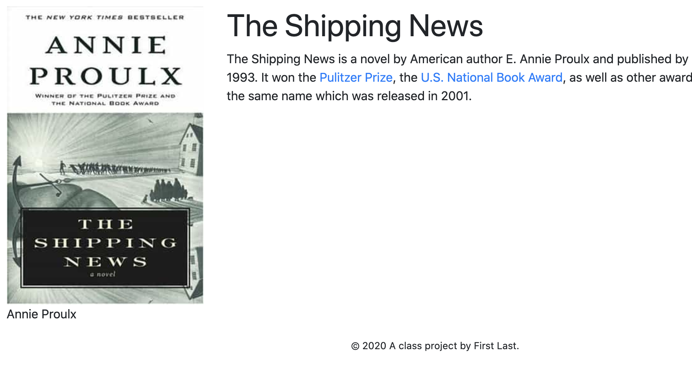

# Detail pages

For our Pirate Cove blog we are going to have a number of detail pages that are all the same except for the story content.

Before we look at the code that makes the detail page, let's look at the example in the browser. There is screenshot below or you can click on the link called "link to a blog entry example" from our index.



This is a detail page made from one of our detail layouts. There are two `.njk` files that make this happen: The "layout" called `src/njk/_layouts/detail-entry.njk` and the "page" called `detail-entry-example.njk`.

## Review the detail layout and pages

The reason we use a "detail layout" is because the structure of every entry in on our blog will be the same, so we don't have to rewrite it. We'll just replace the blocks of content that are unique to each entry.

- Open up the `src/njk/_layouts/detail-entry.njk` file and look at it. This is the content:

```html



<article class="container">
  <div class="row">
    <div class="col-sm-4">
      
        
      
    </div>
    <div class="col-sm-8">
      
        <h1>Entry headline goes here</h1>
        <p>Entry text goes here</p>
      
    </div>
  </div>
</article>

```

Let's explain these:

- The first line _extends_ the base layout so that all the HTML framework for the entire site is included. We don't have to rewrite or copy that.
- Next we have the _block content_. This is the guts of the page, and it is being inserted into the rest of the framework. Everything between the `` and the last `` tag is being inserted _into_ the base page at the content block.
- Within our content block we have the basic HTML for a two-column layout. And, inside of each column we have new _blocks_ for "info" and "story".

## Create our first entry page

Let's create one of our blog pages so we can see our changes.

- Create a new file as `src/njk/2018-10-18.njk` and place the following inside it:


```html


Blog entry title

Blog entry description.


  <h1>Blog headline entry</h1>
  <h5>Captain's log: Oct. XX, 2018</h5>
  <p>Interloper crimp spanker Barbary Coast splice the main brace bilged on her anchor black spot chandler trysail salmagundi. Brigantine fire ship scallywag log squiffy bowsprit lateen sail American Main cog smartly. Dance the hempen jig bilge log galleon pirate yard list Barbary Coast Corsair run a rig.</p>

```

Let's chat a bit about this:

- At the top, we _extend_ the detail layout (which in turn extends the base layout. (It's [Inception](https://media.giphy.com/media/3GuP496Wrkos8/source.gif)).
- Next we have the _block page\_title_ and _block page\_description_ tags so we can udpate those values from the base layout since they are specific to this blog entry.
- Next, we have the _block story_ with some example content.

What you don't see here is _block info_ because that will be the same for every entry. We can fix that in our detail layout.

- Save your page and go look at it in your browser. You should be able to use your navigation link we updated earlier to go to the first page for for Oct. 18th.

## Create your other detail pages

Now, let's create a pages for our other blog entries.

- Inside the `src/njk` folder, create a new files for: `2018-10-19.njk` and =`2018-10-20.njk`. (If you'll recall, this is similar to the file name we used in our navigation except for the extension. Each `filename.njk` file added inside `src/njk/` will become a new HTML page of the same name at `docs/filename.html`.)
- Inside these files, add the same entry code as you did for the first page.

Think about this for a second: You added a new pages to your website with just those few lines of code, compared to when you did this with the Bootstrap Homework assignment, when you had to copy the whole page, likely getting them out of sync. Now you can change the framework of the site without edting individual pages.

## Edit the detail layout

If you remember on our Pirate Cove "blog" pages, we have the same content in the left rail all the time.


As cute as the kitten is, what we need on all the entry pages is the picture of Capt. McGillicutty and his byline, etc. The photo and byline on the left will always be the same. Because of this, we can update the detail-entry layout to use the correct picture and it will update on all three entry pages.

- Open the detail layout `src/njk/_layouts/detail-entry.njk`.
- Replace the code between `` and `` with this:

```html

  
  <p class="byline">By Crit McGillicutty<br>
  <span>Island Breeze Tribune</span></p>

```

This will put the "Crit McGillicutty" byline and photo on every detail entry page, but also allow us to override or add to the block if we needed to.

## Using entries data in the detail page

As you may recall, our `data.json` file has three key values for each entry: date, url and title. We can use that data in this detail page, but we need to tell the page _which_ of the three entries in our data to use. The template can grab the data by its order, but it's weird that it starts counting at `0` instead of at the number 1.

- Open your page `src/njk/2018-10-18.njk`.
- After the _extends_ line, add this:

```html

```

- Now, in your `<h1>` tag, replace the text there with this: `{{ entry.title }}`
- On the next line for the data, replace the text "Oct. XX, 2018" with this: `{{ entry.title }}`
- Save your page and go look at it.

Now your text should look like this:


Update your other two entries in a similar way:

- Add the `set entry` code after the extends line, but change the number to `1` for the 19th and `2` for the 20th.
- Update the _page\_title_ block use use `{{ entry.title}}`.
- Update the _page\_description_ block to say, essentially: "Blog entry for _date_, _title_" but use the proper data tags.

## Check your pages

You should now have a site where the dropdown nav links go to three good story pages and the links from the home page content should also work. Check them now. If they are broken, then compare the filenames used in the navigation with the file names of your pages. The only difference should be `.njk` vs `.html`.

---

NEXT: [Clean up and publishing](static-05-publish.md)
